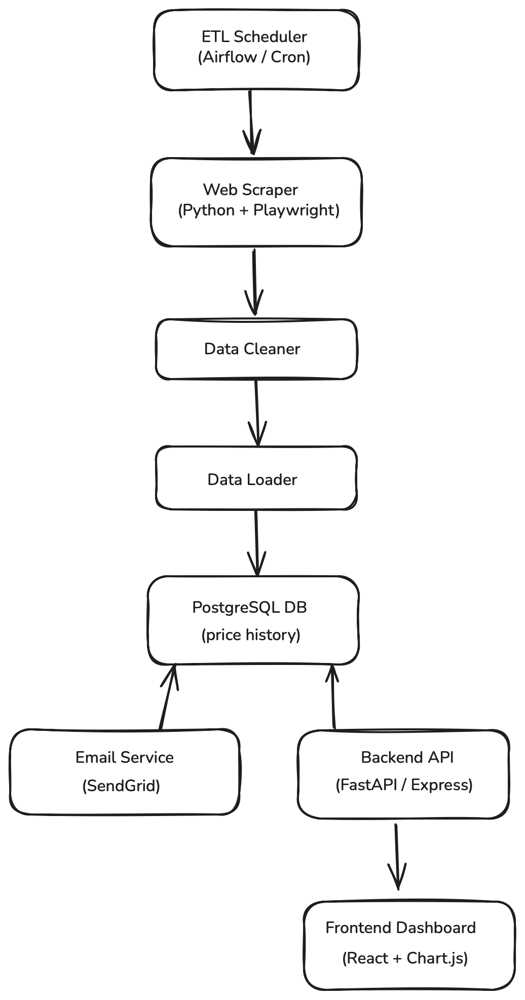

# tarifflo-full-stack-development

## 1. System Diagram

  
*A high-level view of the entire system*

## 2. Component Descriptions

| Component         | Description                                                                 |
|------------------|-----------------------------------------------------------------------------|
| Web Scraper       | Scrapes prices for SKUs from China, Mexico, Canada distributor websites daily. |
| ETL Scheduler     | Schedules the scraping job daily. Could use Airflow or cron.               |
| Data Cleaner      | Validates and formats the raw scraped data.                                |
| Data Loader       | Loads cleaned data into a time-series SQL table.                           |
| SQL Database      | Stores product SKUs, prices, and timestamps.                              |
| Backend API       | Provides endpoints to get historical data, annotations, and trigger emails. |
| Email Notifier    | Sends alerts to customers on price changes.                                |
| BI Dashboard      | Frontend app to view time-series graphs, filter by date, and see notes.    |

## 3. Data Flow

1. Scraper fetches product prices.
2. Data is cleaned and validated.
3. Data gets loaded into a SQL table (price history).
4. Backend checks for changes → triggers email alerts if needed.
5. Frontend queries backend → renders BI graphs & notes.

## 4. Tech Stack

| Layer       | Tool/Tech                              | Why?                                |
|-------------|----------------------------------------|-------------------------------------|
| Scraping    | Python + Playwright/Scrapy             | Handles dynamic websites, fast      |
| Scheduler   | Apache Airflow / Cron                  | Reliable & automatable              |
| Backend     | FastAPI (Python) or Express.js (Node)  | Lightweight, async, easy to scale   |
| Database    | PostgreSQL (with TimescaleDB plugin)   | Time-series support, flexible       |
| Frontend    | React + Chart.js                       | Clean UI & data viz support         |
| Emails      | SendGrid / SMTP                        | Fast, scalable email notifications  |
| Hosting     | Render / Railway / AWS (if scaling)    | Easy deploy, cheap or scalable      |

## 5. Scalability & Reliability

- Scrapers run async (Playwright + asyncio)
- Queueing tasks (Celery/RQ) for ETL steps
- Auto-retry on failures
- DB indexes & caching for fast queries
- Email alert rate-limiting (avoid spamming)
- Monitoring: Sentry (frontend/backend), DB logging

## 6. Error Handling

- Try/catch on scraping failures → log & notify
- Validation step before DB insert (missing SKU, bad price)
- Alert failures log + retry
- 500s caught on backend → friendly error message on frontend

